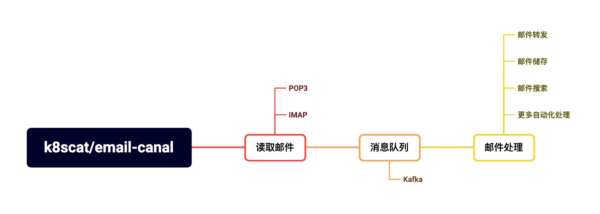

# email-canal

基于 Kafka 的邮件流式处理工具。



## 快速开始

复制 [canal/settings.py](./canal/settings.py) 文件到项目根目录，主要修改 `POP3` 的配置，其他配置保持默认即可。

```bash
# 启动
docker compose up -d
```

## License

[MIT](https://github.com/k8scat/email-canal/blob/main/LICENSE)
